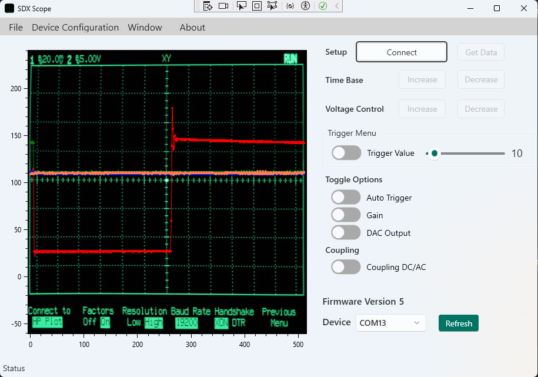

# SDX Scope

A modern, cross-platform WPF application (styled with .NET 9.0 Fluent UI) for interacting with **Haasoscope** — a USB-based open-source oscilloscope. This tool provides real-time data visualization, triggering options, and device control via serial communication.



## 🚀 Features

- 📈 **Real-Time Plotting** with OxyPlot
- 🎨 Fluent UI styling using `.NET 9.0`
- ⚙️ Full control of time base, voltage, and triggering
- 🔌 Serial port communication (COM Port selectable)
- 🧠 Auto-trigger, gain, and DAC toggles
- 🔄 AC/DC Coupling options
- 🔍 Zoom and pan support for scope area
- 📦 Built with MVVM architecture

## 🖥️ Tech Stack

- [.NET 9.0](https://dotnet.microsoft.com/en-us/download/dotnet/9.0)
- [WPF](https://learn.microsoft.com/en-us/dotnet/desktop/wpf/)
- [OxyPlot](https://oxyplot.github.io/)
- [MVVM Pattern](https://learn.microsoft.com/en-us/dotnet/communitytoolkit/mvvm/introduction)
- XAML Fluent styling

## 🛠️ Requirements

- Windows 10/11 with .NET 9.0 SDK
- Haasoscope (or compatible USB oscilloscope hardware)
- Serial port access (USB CDC)

## 📦 Installation

1. Clone the repository:
   ```bash
   git clone https://github.com/your-username/sdx-scope.git
   cd sdx-scope
	```
2. Build the project using Visual Studio 2022/2025 or:

	```
	dotnet build
	```
3. Run the app:
	```
	dotnet run --project SdxScope
	```
## 🔧 Setup

    Select the COM port from the dropdown (auto-detect supported)

    Click Connect to establish communication

    Use the control panel to adjust settings and receive live waveforms

## 📷 UI Preview

    UI includes modern toggle buttons, sliders, and control groups with a dark scope background.

## 📡 Haasoscope

	Haasoscope is an open-source, USB oscilloscope with FPGA-based data acquisition. Learn more: https://github.com/drandyhaas/Haasoscope
## 🤝 Contributing

Pull requests welcome! For major changes, please open an issue first to discuss what you'd like to change.
## 📄 License

	This project is licensed under the MIT License. See the LICENSE.txt file for details.